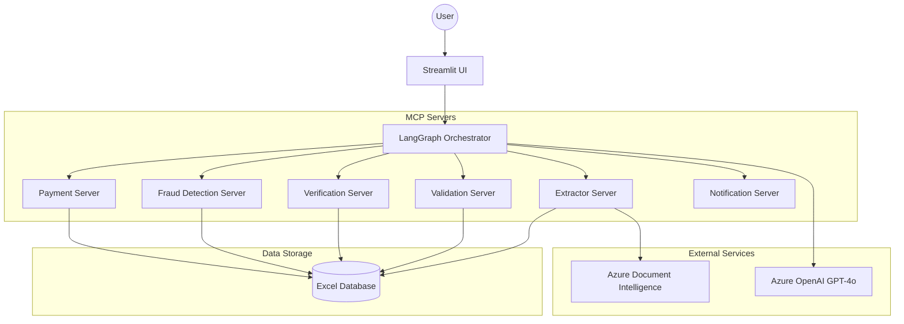

# Architecture Overview

The Insurance Claim Processing system is built using a multi-agent orchestration framework powered by **LangGraph** and the **Model Context Protocol (MCP)**.

## System Components

### 1. Orchestrator (LangGraph)
The core logic resides in a LangGraph-based agent. It manages the state and decides which tool (MCP Server) to invoke based on the user's request and the current progress of the claim.

### 2. MCP Servers
These are independent services that provide specific capabilities:
- **Extractor Server**: Uses Azure Document Intelligence to extract data from uploaded PDFs (Aadhaar, License, RC).
- **Validation Server**: Compares extracted data against user-provided form data.
- **Verification Server**: Verifies the policy details against the master insurance database.
- **Fraud Detection Server**: Analyzes the claim for potential fraud based on rules and cross-referencing data.
- **Payment Processing Server**: Handles payment record creation for approved claims.
- **Notification Server**: Notifies underwriters or users about the claim status.

### 3. Frontend (Streamlit)
A user-friendly interface for submitting claims, uploading documents, and visualizing the agent's reasoning process.

## Architecture Diagram

## Workflow Sequence

1. **Submission**: User submits a claim form and uploads documents via Streamlit.
2. **Extraction**: The agent calls the `Extractor` to pull text from PDFs.
3. **Validation**: The agent calls `Validation` to ensure form data matches documents.
4. **Verification**: The agent calls `Verification` to check the policy in the database.
5. **Fraud Check**: The agent calls `Fraud Detection` to assess risk.
6. **Decision**:
    - If **Approved**: The agent calls `Payment Processing` and `Notification`.
    - If **Rejected**: The agent calls `Notification` with the reason.
